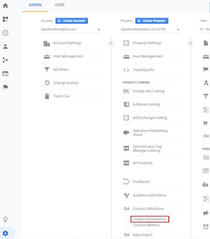
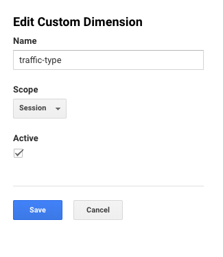
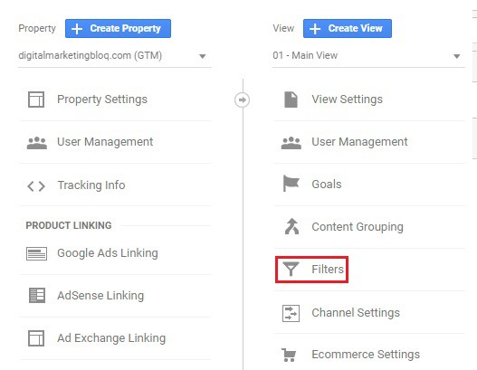
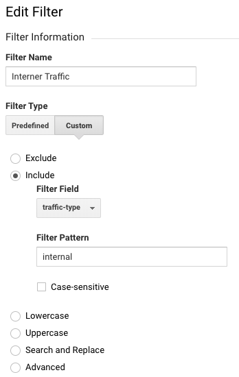
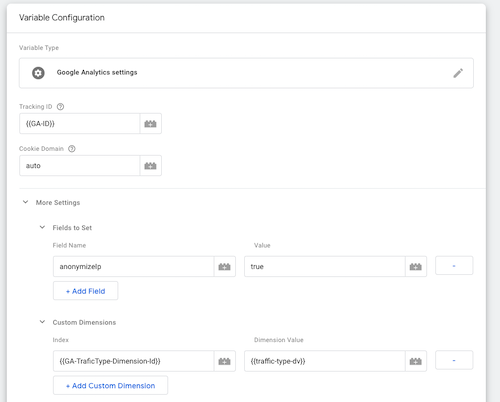

# Usage
- After installing the plugin go to the backend menu page `Towa Gdpr` and setup all the fields in the settings group.
- The cookies / trackers are grouped to give users better understanding of what the trackers are for. 
- Common examples of groups are: Marketing, Personalisation, Statistics
- Every cookie has Javascript code that should be executed if the user consents to it. This could be tracker codes from Google Analytics or Facebook or anything else.
- Every cookie has optional links to your tracking providers data protection policies. If you use external services this is mandatory.

## Hashing functionality
To guarantee users have to consent again if cookies change, a hashing functionality was added to the plugin if you need. 
To generate a new hash you can click the `generate & update hash` functionality on the settings page of the Plugin.

## No cookie pages
Define Pages where the cookie notice isn't shown and won't set the cookies.

## Consent Logging
- Settings made by Admin will be saved into database table `tableprefix_towa_gdpr_settings`

## Accordion
- (Optional) Accordion functionality can be activated via the plugin settings. When active each cookie group will be wrapped by an accordion.The setting is global for all cookies. 
- Accordion toggle button text is also set in the plugin settings.

## Filtering internal traffic using Google Tag Manager
You have the possibility to add IPs (IPv4, IPv6 or CDIR subnet) on the setting page. Requests matching one of these IPs or subnets will be recognized as internal.  
The plugin will check with a async XHRequest, if the request is from an internal or external resource. After the request the variable 'traffic-type' and the event 'trafficTypeLoaded' will be pushed into the Datalayer.
There is further configuration in GA and GTM needed.

### Google Analytics Configuration 

1. Custom Dimension  
   * Browse to the admin section of the Google Analytics Property where you want to filter internal traffic. In the Property column, click on Custom Definitions > Custom Dimensions:  
   
     
   * Next click on + NEW CUSTOM DIMENSION and add following Dimension   
   
   
   * After you have added the Custom Dimension you will see the Dimension index in the overview table. You will need this index for the GTM configuration later.  

2. Internal Traffic Filter
   * Create the different views (All / Internal / External) and add a filter to the internal and external view.
     
   * Next, click on + ADD FILTER.
   * For internal view use following settings:
   
   * For external view change the filter pattern to external

### Google Tag Manager Configuration 

You can import our [sample config](example/gtm-example-config.json) and skipp all further steps for convenience.
Please change the values of the variables GA-ID (you analytics id), and GA-TraficType-Dimension-Id (the index of the dimension created in Analytics)
 
 1. Add following variables (Name - Type - Value)
    * Analytics Cookie - 1st-Party Cookie - Analytics 
      * The value is dependent on your configuration in the plugin settings (cookie name)
    * DNT - Custom Javascript 
      ```javascript
      function dnt() {
        if (window.doNotTrack || navigator.doNotTrack || navigator.msDoNotTrack || 'msTrackingProtectionEnabled' in window.external) {
            // The browser supports Do Not Track!
            if (window.doNotTrack == "1" || navigator.doNotTrack == "yes" || navigator.doNotTrack == "1" || navigator.msDoNotTrack == "1" || window.external.msTrackingProtectionEnabled()) {
                return true;
            } else {
                return false;
            }
        }
    
        return false;
      }
      ```
      
    * GDPR Hash - JavaScript Variable - towaGdprContext.settings.hash
    * GdprAccepted Cookie - 1st-Party Cookie - GdprAccepted
    * GDPR Hash valid - RegEx Table - 
      * Input Variable: {{GdprAccepted Cookie}}
      * Pattern: {{GDPR Hash}} -> true
    * traffic-type - Data Layer Variable 
      * Data Layer Variable Name: traffic-type-dv
      * Data Layer Version: Version 2
      * Set default Value: external 
    * Google UA - Google Analytics settings. Replace {{GA-ID}} with your Analytics Tracking ID an {{GA-TraficType-Dimension-Id}} with the index of the dimension created in Analytics.  
        
        
 2. Add the following Triggers:
    * !Analytics - Custom Event
      * Event Name: .* (use regex matching)
      * This Trigger fires on 'Some Custom Events'
        * Analytics Cookie - does not equal - true
    * !GdprAccepted - Custom Event
      * Event Name: .* (use regex matching)
      * This Trigger fires on 'Some Custom Events'
         * GDPR Hash valid - does not equal - true
    * Dont Track - Custom Event
      * Event Name: .* (use regex matching)
      * This Trigger fires on 'Some Custom Events'
         * DNT - equals - true
    * Gdpr Button Click - Click - All Elements
      * This Trigger fires on 'Some Clicks'
         * Click classes - matches RegEx - (Towa-Gdpr-Plugin__accept-all|Towa-Gdpr-Plugin__save|Towa-Gdpr-Plugin__decline-all)
    * trafficTypeLoaded - Custom Event 
      * Event name: trafficTypeLoaded
      * This Trigger fires on 'All Custom Events'
  
  3. Add following Tags
     * Analytics on Cookie-Accept:
        * TagType: Google Analytics: Universal Analytics
        * Track Type: Pageview
        * Google Analytics settings: {{Google UA}}
        * Firing Triggers:
            * Gdpr Button Click
        * Exceptions:
           * !Analytics
           * !GdprAccepted
           * Dont Track
     * Analytics on Pageview:
        * Tagtype: Google Analytics: Universal Analytics
        * Track Type: Pageview
        * Google Analytics settings: {{Google UA}}
        * Firing Triggers:
            * trafficTypeLoaded
        * Exceptions:
           * !Analytics
           * !GdprAccepted
           * Dont Track
